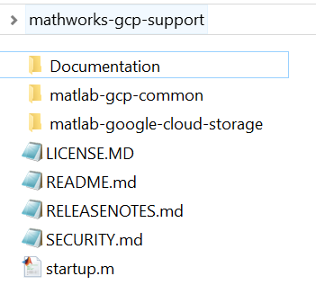

# MATLAB Interfaces *for Google Cloud Platform™ (GCP)*
Source code, documentation and reference material supporting MathWorks products on the Google Cloud Platform.

## System Requirements:
MathWorks Products (http://www.mathworks.com)

1. [MATLAB®](https://www.mathworks.com/products/matlab.html)
2. [MATLAB Compiler™](https://www.mathworks.com/products/compiler.html) and [MATLAB Compiler SDK™](https://www.mathworks.com/products/matlab-compiler-sdk.html)
3. [MATLAB Production Server™](https://www.mathworks.com/products/matlab-production-server.html)
4. [MATLAB Parallel Server™](https://www.mathworks.com/products/matlab-parallel-server.html)

Google Cloud Products (https://cloud.google.com/products)
1. Google Cloud account
2. [GCP SDK for Java](https://googleapis.dev/java/google-cloud-clients/latest/overview-summary.html)

Please note that some of the components included in this repository may require
different versions that supercede these requirements.

## Getting Started
Clone this repository using the recursive flag.
```
git clone --recursive https://github.com/mathworks-ref-arch/mathworks-gcp-support.git
```

This is what your top level directory<sup>1</sup> should look like:



### Build the Java components

The MATLAB code uses a single Java SDK for all matlab interfaces for google cloud which can be built using:
```bash
cd mathworks-gcp-support/matlab-gcp-common/Software/Java
mvn clean package
```

Please refer to the [Documentation](Documentation/README.md) to get started.

## License
The License agreement for this software can be found [here](LICENSE.md).    

## Enhancement Request
Provide suggestions for additional features or capabilities using the following link:   
https://www.mathworks.com/products/reference-architectures/request-new-reference-architectures.html

## Support
Email: `mwlab@mathworks.com` or please log an issue  

## Notes:

<sup>1</sup> Used with permission from Microsoft.   

[//]: #  (Copyright 2020 The MathWorks, Inc.)